# MelisCmsNews (React back-office) — Functional & Technical Documentation (for AI)

> **What this is.** MelisCmsNews is the **news / blog system** of Melis: a back-office tool to
> write and manage multilingual news articles (with images, documents and SEO), plus three
> front-end **content blocks** to display them (latest news, a paginated list, a single-article
> page). This document covers it **in the new React back-office** (`/melis-react`): the module
> ships a **native full-React brick** — a real React UI for listing and editing articles, calling
> a `react-api` JSON layer — with a **New / Old toggle** that can fall back to the legacy tool in
> an iframe. For the underlying data model, services, events and the three front plugins, see the
> [legacy tool doc](./MelisCmsNews.md); this doc does not repeat them.
>
> **How this document is organised — two clearly separated parts:**
> - **[Part A — Functional Guide](#part-a--functional-guide)** — for everyday users (and the
>   chat assistant) using the React back-office. Plain language.
> - **[Part B — Technical Reference](#part-b--technical-reference)** — for developers and AI
>   building inside the React UI, with code (brick manifest, endpoints, capabilities).
>
> **Audience**: consumed by the **MelisAI** MCP. **Status**: reviewed 2026-08-19.

---

## 0. Where this lives in the React back-office — read this first

- **Brick kind: native full-React** (not an iframe brick). The UI is authored in React
  (`ui-react/src/`) and reads/writes through `/melis/react-api/news…` endpoints owned by the
  module. It also keeps a **New / Old toggle** on the list: *Old* renders the legacy tool in an
  iframe (`/melis/react-tool-page?key=meliscmsnews_left_menu`), *New* is the React UI (default).
- **No `config/react-api.php` file.** Unlike MelisCmsSlider (which puts its routes in a dedicated
  `react-api.php`), MelisCmsNews declares its react-api routes **inline in `config/module.config.php`**
  — nested under the shared `melis-react-api` route node so its React pages keep calling
  `/melis/react-api/news[…]`. The tool's capabilities live in `config/react.capabilities.php`.
- **Where in the menu.** Sidebar → **Site Tools** group → **News** (`Actualités`). The manifest
  `route` is the tree route `/melis-cms/news`; `forwardKey` `MelisCmsNews/MelisCmsNewsList` maps
  the legacy left-menu node to it. The tool appears **only if the module is activated** (modular
  brick discovery, see §B5).
- **Two levels, surfaced as in-tool sub-tabs.** A single shell tab **News** hosts everything: the
  **list of articles** and, per opened/new article, a **sub-tab** with the full editor. Navigation
  is internal (the brick manages its own URL segment `/melis-cms/news/:id` cosmetically; it does
  **not** open general shell tabs).
- **Coupled / optional siblings.** Extra sections of the editor light up only when the matching
  module is active — **Slider** (`MelisCmsSlider`), **Categories**, **Tags** (`MelisCmsTags`),
  **Author** (`MelisCmsUserAccount`), **Comments** (`MelisCmsComments`). See §A5 and the
  [legacy doc §A4/§B7](./MelisCmsNews.md).

---
---

# PART A — Functional Guide

## A1. What you can do with MelisCmsNews in the new back-office

- **Write news articles** — title, subtitle and up to 10 rich-text paragraphs, **in several
  languages** (a language switcher at the top of the editor).
- **Manage articles** — a searchable, sortable list with KPI cards, a column manager, an Export,
  per-row edit / delete, and status (Published / Unpublished).
- **Schedule** — set a **publish** and an **unpublish** date so articles appear/disappear
  automatically.
- **Attach media** — up to 3 images and 3 document files per article (added after the first save).
- **Optimise for search** — friendly **URL**, **meta title/description**, redirect and canonical.
- **Preview** — see the saved article rendered on its detail page, in an iframe, before it's public.
- **Compare New vs Old** — switch the whole tool between the React UI and the classic tool with the
  **New / Old** toggle.
- **Show news on the site** — from the React page editor, drop **Latest News**, **News List** or
  **News Detail** and configure them (§A7).

## A2. Finding it in /melis-react

**Where:** left sidebar → **Site Tools** → **News** (`Actualités`). It opens as a top tab named
**News**.

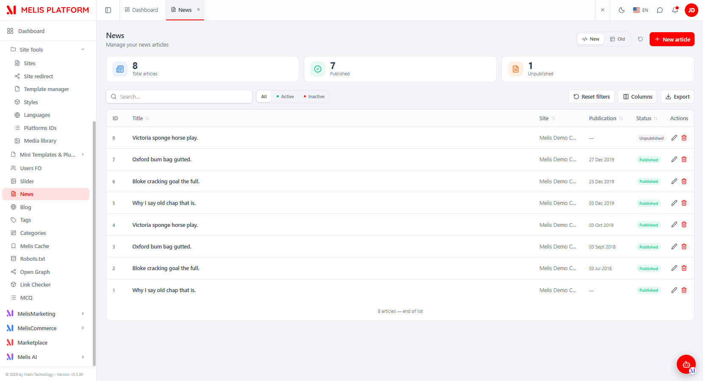
*The React News list: KPI cards (Total articles / Published / Unpublished), a search box with All / Active / Inactive filters, a Columns manager, an Export button, the New/Old toggle (top-right) and the "+ New article" button. Each row shows ID, title, site, publication date and status, with edit and delete actions.*

## A3. Key words explained

- **Article (news / post)** — one news item: base fields (site, status, publish/unpublish dates)
  plus per-language texts (title, subtitle, paragraphs) and per-language SEO.
- **Language switcher** — the editor holds every translation at once; the switcher at the top picks
  which language you edit (saved all together, like the legacy form).
- **New / Old** — the two views of the same tool: **New** = React UI, **Old** = the classic tool in
  an iframe.
- **Sub-tab** — an opened (or new) article appears as a tab in the bar under the top bar; each stays
  mounted so switching between articles is instant.

> For the domain glossary and the data model, see the [legacy doc](./MelisCmsNews.md).

## A4. The list of articles

You see **every article on the platform**. The list has **KPI cards** (Total articles, Published,
Unpublished), a **search** box with **All / Active / Inactive** status pills, a **Columns** manager
(hide/reorder columns), an **Export** button and **Reset filters**. Click a column header to
**sort**. Each row: **edit** (opens the article as a sub-tab) and **delete**. **+ New article**
starts a blank editor.

> **Tip:** the **New / Old** toggle (top-right) switches the list — and only the list — between the
> React UI and the legacy tool in an iframe; use it to compare the two interfaces.

## A5. Creating & editing an article — one scrollable form

Clicking **+ New article** (or editing a row) opens the article as a **sub-tab** with a single
scrollable editor: a wide **content column** on the left and a **settings sidebar** on the right.

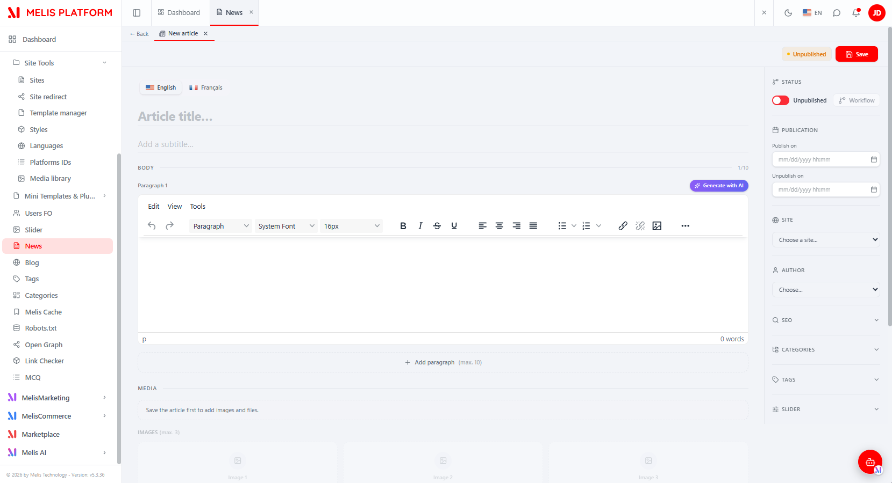
*The new-article editor — a language switcher (English / Français), the Title and Subtitle fields, the BODY with Paragraph 1 (a WYSIWYG editor and "Generate with AI"), "+ Add paragraph (max. 10)", and a MEDIA area that reads "Save the article first to add images and files." The right sidebar holds Status (Published/Unpublished toggle + Workflow), Publication (Publish on / Unpublish on), Site, Author, SEO, Categories, Tags and Slider.*

**Content column**

- **Title / Subtitle** — plain-text, at the top (per language).

  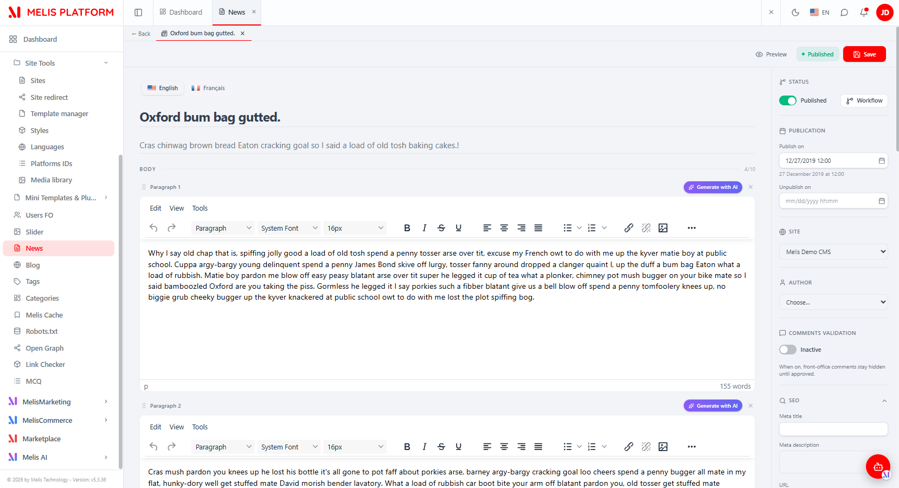
  *Editing an article's texts — title, subtitle and a rich-text (TinyMCE-style) paragraph editor; paragraphs can be added and reordered.*

- **Body** — up to **10 rich-text paragraphs** (WYSIWYG), each with a **Generate with AI** helper;
  **+ Add paragraph (max. 10)**.
- **Media** — appears **after the first save**: up to **3 images** (Replace / Remove per slot) and up
  to **3 file attachments**.

  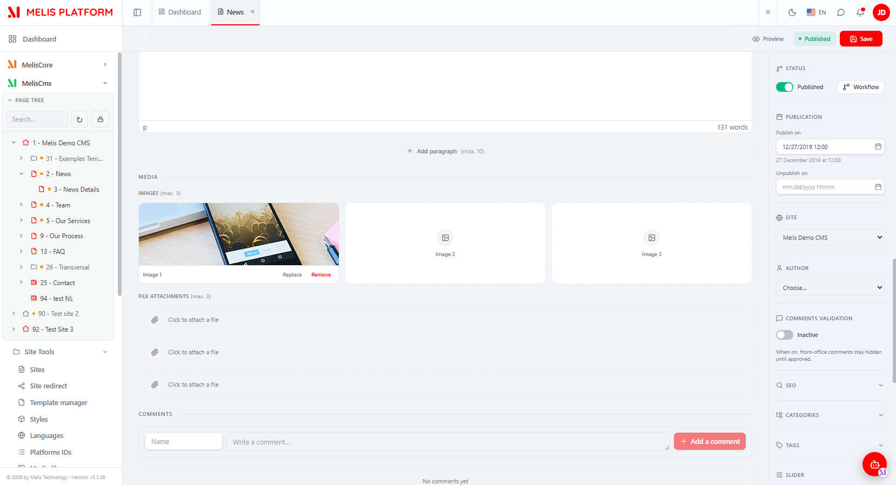
  *The Media area — Images (max. 3, with Replace/Remove) and File attachments (max. 3), plus the native Comments moderation panel below when MelisCmsComments is active.*

- **Comments** — a native moderation panel (add a comment; approve/refuse/delete) shown only when
  **MelisCmsComments** is installed.

**Settings sidebar** (collapsible sections)

- **Status** — a **Published / Unpublished** toggle, plus a **Workflow** button (validation,
  provided by MelisSmallBusiness) when available.
- **Publication** — **Publish on** and **Unpublish on** date-time pickers.

  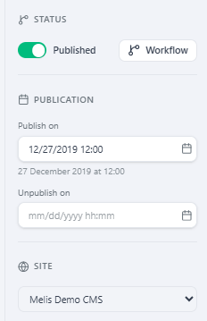
  *The top of the settings sidebar — the Published toggle with Workflow, the Publish/Unpublish dates, and the Site selector.*

- **Site** — the site the article belongs to.
- **Author** — an author picker (only when **MelisCmsUserAccount** provides the `cnews_author_account`
  column).
- **SEO** — the article's friendly **URL**, **URL redirect**, **URL 301**, **Meta title**, **Meta
  description** and **Canonical URL** (per language).

  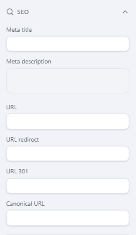
  *The SEO section — Meta title, Meta description, URL, URL redirect, URL 301 and Canonical URL.*

- **Categories / Tags / Slider** — optional sections that appear only when the matching module is
  active (**Categories**, **MelisCmsTags**, **MelisCmsSlider**).

**Save** (top-right) persists everything (all translations, SEO, categories, tags) in one call.

> **Note:** on a brand-new article the **Media** area is locked ("Save the article first to add
> images and files") because uploads need the article to exist first.

## A6. Preview

Once saved, a **Preview** area (and a **Preview** button) render the article on its detail page in
an iframe — with a **Display in new tab** option and, when a site has several detail pages, a page
selector.

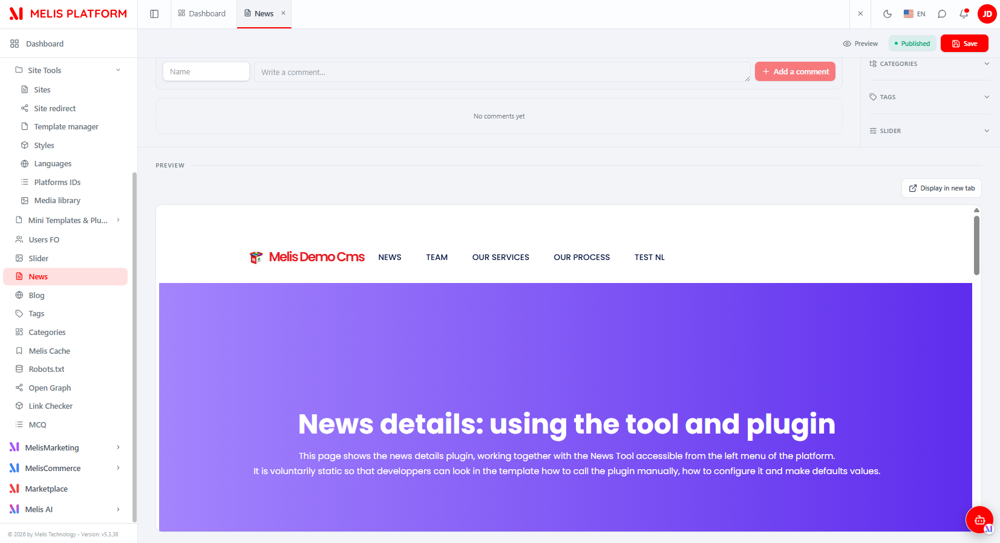
*The Preview area — the saved article rendered inside its NEWS_DETAIL page, with a "Display in new tab" button.*

## A7. Showing news on a page (React page editor)

From the **React page editor** (MelisCms → open a page → Edition), open the **plugins** panel and
drop one of the three News blocks onto the page.

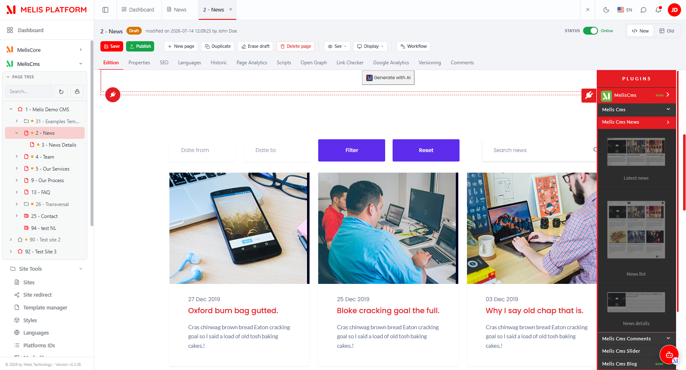
*The React page editor with the plugins panel open — the News content blocks are dropped onto the page.*

Each block has a **settings modal with tabs** (the classic Melis plugin config modal, rendered
inside the React editor):

- **Latest News** — a short "latest articles" teaser. **Properties** (template, source site, news
  detail page) and **Filters** (sort, order, limit, date range, default search, category).

  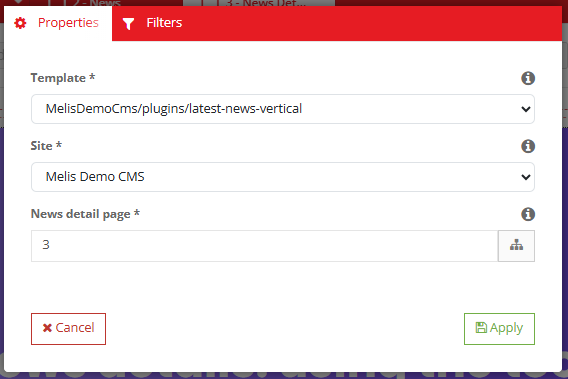
  *Latest News → Properties — Template, Site and News detail page (with a page-tree picker).*

  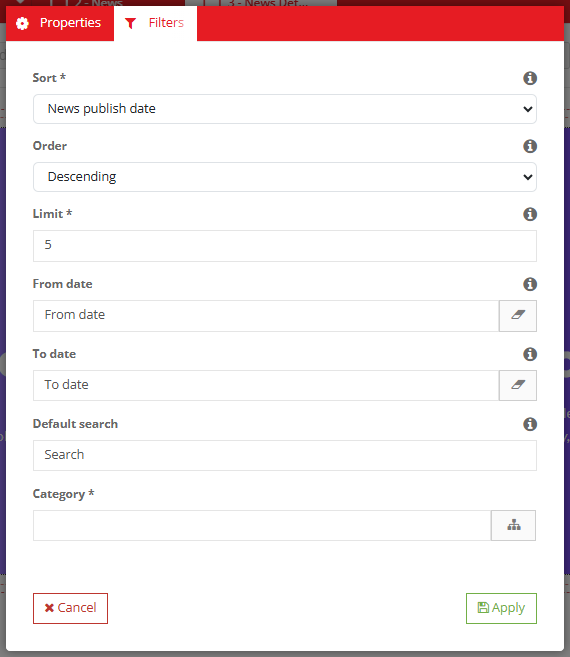
  *Latest News → Filters — Sort, Order, Limit, From/To date, Default search and Category.*

- **News List** — a full, paginated list. **Properties**, **Pagination** (news per page, pagination
  links) and **Filters**.

  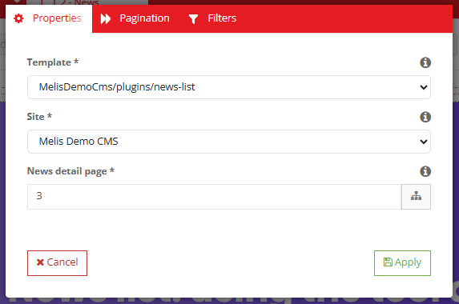
  *News List → Properties — Template (news-list), Site and News detail page.*

  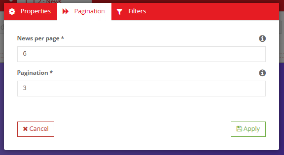
  *News List → Pagination — News per page and the number of page links to show.*

  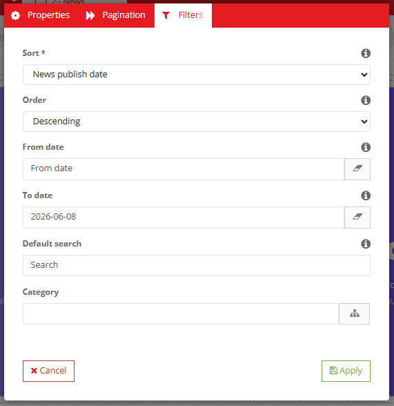
  *News List → Filters — Sort, Order, From/To date, Default search and Category.*

- **News Detail** — the single-article page the other two link to. One tab: **Properties**
  (template, default news).

  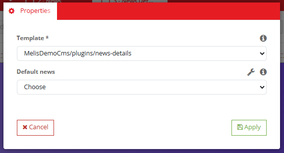
  *News Detail → Properties — Template (news-details) and a Default news selector (with a wrench shortcut to the News tool).*

## A8. Common tasks — "How do I…?"

- **Write an article** → News → **+ New article** → fill Title / Body and pick a **Site** →
  **Save** → then add images on the **Media** area.
- **Make an article appear later / expire** → set **Publish on** / **Unpublish on** in the
  Publication section.
- **Translate an article** → use the **language switcher** at the top of the editor, fill each
  language, **Save** once.
- **Change an article's web address** → the **SEO** section (URL / Meta / Canonical).
- **Compare with the classic tool** → list → top-right **New / Old** toggle → **Old**.
- **Show the latest news on a page** → React page editor → Edition → drag **Latest News** → set
  site, detail page and how many.
- **Build a News index page** → drag **News List**; set Pagination and the detail page.
- **Set up the single-article page** → drop **News Detail** on the detail page; point the Latest/List
  blocks' "News detail page" at it.

---
---

# PART B — Technical Reference

## B1. React presence at a glance

| Item | Value |
|---|---|
| Brick kind | **Native full-React** (with a New/Old legacy-iframe fallback on the list) |
| Brick id | `news` (matches `brick.tsx` ⇄ `brick.manifest.json`) |
| Manifest `route` | `/melis-cms/news` (the tree route; also `/melis-cms/news/:id` for a deep link) |
| `label` | `Actualités` |
| `forwardKey` | `MelisCmsNews/MelisCmsNewsList` |
| `melisKey` (manifest / Old-view iframe) | `meliscmsnews_left_menu` (renderable ZONE key) |
| `entry` | `brick.js` |
| `subTabs` | `true` (the tool draws its **own** in-tool sub-tab bar, not the host bar) |
| `persistent` | `true` (brick kept mounted; deep links re-open articles without remount) |
| Access-guard / capabilities melisKey | `meliscmsnews_tools_section` (rights-bearing node) |
| API base | `/melis/react-api/news` (+ `/melis/react-api/news-sites`, `/news-languages`) |
| Tables (owned) | `melis_cms_news`, `melis_cms_news_texts`, `melis_cms_news_seo`, `melis_cms_news_category` — see [legacy doc §B2](./MelisCmsNews.md) |
| Activation-gated | Yes (appears iff the module is in `config/melis.module.load.php`) |

## B2. The brick — anatomy

Source in `ui-react/` (Vite **IIFE**, React / ReactDOM / react-router-dom externalised to the host
globals `MelisReact*`, output to `public/ui-react/brick.js` next to `brick.manifest.json`). The
brick injects its own Tailwind-processed CSS once at runtime (id-guarded), since the host loads only
`brick.js`.

`ui-react/src/brick.tsx` registers ONE routed component under the brick id:
```tsx
import NewsBrick from './NewsBrick'
window.__melisRegisterBrick?.({ id: 'news', Component: NewsBrick })  // id MUST match the manifest
```

Manifest (`public/ui-react/brick.manifest.json`):
```json
{ "id": "news", "route": "/melis-cms/news", "label": "Actualités",
  "forwardKey": "MelisCmsNews/MelisCmsNewsList", "melisKey": "meliscmsnews_left_menu",
  "entry": "brick.js", "persistent": true, "subTabs": true }
```

React components (`ui-react/src/`):

| File | Role |
|---|---|
| `brick.tsx` | Brick entry point — injects CSS once, registers `id: 'news'` with `NewsBrick`. |
| `NewsBrick.tsx` | Thin wrapper that renders `NewsPage` (mounted once on the "News" tab). |
| `NewsPage.tsx` | Container. Drives the **in-tool sub-tabs** (`SubTabBar`: ← Back + one tab per open article), keeps each `NewsFormPage` mounted (state preserved), mirrors the active sub-tab in the URL cosmetically (`history.replaceState`, no React-Router nav), and re-opens an article when navigated to `/melis-cms/news/:id` from outside (e.g. the Workflow eye). |
| `NewsListPage.tsx` | The article list — KPI cards, search + All/Active/Inactive filters, sortable columns, column manager, Export (xlsx), keyset pagination, per-row edit/delete, the **New/Old** `mode` toggle and the **Old-view iframe** `/melis/react-tool-page?key=meliscmsnews_left_menu`. |
| `NewsFormPage.tsx` | The single-page editor — language switcher, title/subtitle, up to 10 WYSIWYG paragraphs (drag-reorder, "Generate with AI"), media (images/files), and the settings sidebar (Status, Publication, Site, Author, SEO, Categories, Tags, Slider, Comments). |
| `components/PreviewTab.tsx` | The Preview iframe + page selector. |
| `components/ui/` | In-brick primitives (`Button`, `Input`, …). |
| `lib/news-api.ts` | The API client (see §B3) — endpoint URLs + the `{ success, data, error }` contract, plus the **legacy** media upload/remove calls. |
| `lib/i18n.ts` | In-file `{fr,en}` dictionary (`t`, `newsLang`) driven by the host language. |
| `lib/utils.ts` | `cn()` class helper. |
| `use-keyset-list.ts` | Keyset-list hook (cursor pagination for the list). |
| `shared/` | `useCaps.ts` (bridge to the host capability resolver), `useIsNarrow.ts`, `ExpandableRow.tsx`, `confirm-dialog.tsx`, `melis-form-errors.tsx`, `use-drag-reorder.ts`. |

> **Brick constraint:** the bundle externalises only React/ReactDOM/react-router-dom to the host
> globals; it cannot import host modules — hence in-file i18n and its own bundled UI primitives.

## B3. React API — endpoints

There is **no `config/react-api.php`**. The routes are declared **inline in `config/module.config.php`**,
nested under the shared `melis-react-api` route node so they mount under `/melis/react-api/…`.
Controller: **`MelisCmsNews\Controller\MelisCmsNewsReactApiController`** (invokable alias
`MelisCmsNews\Controller\MelisCmsNewsReactApi`). Contract `{ success, data, error }`; every fetch
sends `X-Requested-With: XMLHttpRequest` + `credentials:'include'`.

| Method & URL | Action | Purpose |
|---|---|---|
| `GET /news` | `list` | List articles (keyset: `limit`, `search`, `status`, `siteId`, `sort`, `dir`, `after`, optional `langId`) → `{items,total,nextCursor}` |
| `GET /news/stats` | `stats` | KPI `{total, published, draft}` |
| `GET /news/:id` | `get` | One article (`?langId=` → that translation; base fields + paragraphs + images/docs + SEO + categoryIds + tagIds) |
| `POST /news/save` | `save` | Create / update (`{id?, translations[]|title…, status, siteId, publishDate?, unpublishDate?, sliderId?, authorId?, validateComments?, categoryIds?, tagIds?, seo?}`) |
| `DELETE /news/delete/:id` | `delete` | Delete an article (+ its texts + SEO) |
| `GET /news/categories` | `categories` | Available categories (`?langId=&siteId=`) via `MelisCmsCategory2Service` |
| `GET /news/tags` | `tags` | Available tags (module `MelisCmsTags`; empty list if its tables are absent) |
| `GET /news/users` | `users` | Front-office users as authors (module `MelisCmsUserAccount`; empty if absent) |
| `GET /news/preview/:id` | `previewUrl` | Preview URL + list of NEWS_DETAIL pages for the article's site |
| `GET /news/:id/comments` | `comments` | All comments of an article (404 if `MelisCmsComments` off) |
| `POST /news/comments/save` | `commentSave` | Add/edit a comment (BO → approved) |
| `POST /news/comments/approve/:cid` | `commentApprove` | Approve a comment |
| `POST /news/comments/refuse/:cid` | `commentRefuse` | Refuse a comment |
| `DELETE /news/comments/delete/:cid` | `commentDelete` | Delete a comment |
| `GET /news-sites` | `sites` | Sites list (`site_label`/`site_name`) |
| `GET /news-languages` | `languages` | CMS languages (`melis_cms_lang`) |

Media upload/remove use the **legacy** MelisCmsNews endpoints (no backend change), not react-api:
- `POST /melis/MelisCmsNews/MelisCmsNews/saveFileForm` (multipart image/file upload)
- `POST /melis/MelisCmsNews/MelisCmsNews/removeAttachFile` (clears the column + deletes the file)

Example (from `lib/news-api.ts`):
```ts
// list
await apiFetch<NewsListResult>(`/melis/react-api/news?${qs}`)   // qs: limit,search,status,siteId,sort,dir,after
// one article in French
await apiFetch<NewsDetail>(`/melis/react-api/news/42?langId=1`)
// save (all translations in one call, like the legacy form)
await apiFetch<{id:number}>('/melis/react-api/news/save', {
  method: 'POST', headers: { 'Content-Type': 'application/json' },
  body: JSON.stringify({ id: null, siteId: 1, status: 1,
    translations: [{ langId: 1, title: 'Hello', paragraphs: ['<p>…</p>'], seo: { url: 'hello' } }] }),
})
```

> **Note on the data layer.** The controller mixes the module's **`MelisCmsNewsService`**
> (`getNewsById`, `saveNews`, `deleteNewsById`, `getNewsDetailsPagesBySite`) with **direct
> parameterised SQL** (list keyset, stats, SEO table, category/tag link tables) and the shared
> `MelisCmsCategory2Service`. Optional columns/tables are feature-detected before use
> (`cnews_author_account`, `cnews_validate_comments`, the `melis_cms_tag*` tables) so a missing
> optional module never breaks a save. The service and events are documented in the
> [legacy doc §B3](./MelisCmsNews.md).

## B4. Capabilities (advanced rights)

Declared in **`config/react.capabilities.php`** under the **rights-bearing** menu node
`meliscmsnews_tools_section` (NOT the manifest/zone key `meliscmsnews_left_menu`, which is the
type-link target used by the Old-view iframe and the legacy ToolTabBar). `MelisCmsNews\Module::getConfig()`
merges this file via `ArrayUtils::merge`.

```
meliscmsnews_tools_section
└─ actions: list · create · edit · delete · export
```
`Capabilities::flatten()` turns these into the strings `list`, `create`, `edit`, `delete`, `export`,
passed to `window.__melisUseCaps(melisKey).can(cap)` in React (via `shared/useCaps.ts`) and to
`denyUnlessCan(cap)` server-side.

Server-side, every controller action is guarded twice (default-allow for an undeclared cap):
```php
private const MELIS_KEY = 'meliscmsnews_tools_section';
if ($deny = $this->denyUnlessAccess())        { return $deny; }   // auth + MelisCoreRights::canAccess(MELIS_KEY) → 401/403
if ($deny = $this->denyUnlessCan('list'))     { return $deny; }   // capability (CapabilityGuardTrait)
```
`saveAction` picks `create` vs `edit` from the presence of an id; `deleteAction` uses `delete`;
comment mutations use `edit`/`delete`. React gates the **+ New article** button on `can('create')`
and the list body on `can('list')`.

## B5. Host integration

- **Discovery / gating.** `GET /melis/react-api/react-modules` lists active modules that ship a
  `brick.manifest.json`; the host (`melis-core/ui-react/src/lib/bricks.ts`) loads `brick.js` (shared
  React globals) and mounts the brick. Removing `MelisCmsNews` from `config/melis.module.load.php`
  makes it disappear.
- **Menu → route.** `useNavMenu` maps `forwardKey` `MelisCmsNews/MelisCmsNewsList` to the tree route
  `/melis-cms/news`; `Component: NewsBrick` renders there.
- **Sub-tabs (`subTabs: true`).** MelisCmsNews draws its **own** in-tool sub-tab bar inside
  `NewsPage` (state-local, one tab per open article, a ← Back to the list) — it does **not** call
  `__melisOpenTab` / the host sub-tab bridge for editing. It does read the scoped `useLocation()` so
  a **deep link** `/melis-cms/news/:id` (from `__melisOpenTool`, e.g. the Workflow eye) re-opens the
  article each navigation; the tab label arrives via `loc.state.melisTabLabel`.
- **New/Old toggle.** Local `mode: 'react' | 'iframe'` on `NewsListPage`; *Old* keeps a mounted
  iframe `/melis/react-tool-page?key=meliscmsnews_left_menu` (`MelisReactOverride`). The legacy view
  stays 100 % legacy (its own ToolTabBar handles list ⇄ form).
- **Capabilities bridge.** `shared/useCaps.ts` delegates to the host resolver via
  `window.__melisUseCaps(melisKey)` (fetch `/me`, cache, default-allow) — the brick never
  reimplements it.
- **i18n.** The brick ships an in-file `{fr,en}` dictionary (`lib/i18n.ts`) driven by the host
  language.
- **Optional-module gating.** `fetchActiveModules()` reads `/melis/react-api/react-modules`; the
  editor shows the Slider / Tags / Categories / Author / Comments sections only when the matching
  module is active (and the corresponding endpoints 404 gracefully when it is not).
- **Generic bits stay in `melis-react-api`.** `CapabilityGuardTrait` + the `Capabilities` resolver
  are generic; the tool's controller/routes/caps live **in this module** (modularity rule).

## B6. Quick code map

```
melis-cms-news/
├── config/
│   ├── module.config.php        react-api routes inline under `melis-react-api` (/melis/react-api/news…,
│   │                            /news-sites, /news-languages) + invokable → MelisCmsNewsReactApi
│   └── react.capabilities.php   melisReactToolCapabilities keyed on meliscmsnews_tools_section
├── src/Controller/
│   └── MelisCmsNewsReactApiController.php   list/get/save/delete/stats/categories/tags/users/preview
│                                           + comments moderation; denyUnlessAccess + denyUnlessCan
├── ui-react/                    Vite IIFE brick (React external)
│   ├── vite.config.ts           → ../public/ui-react/brick.js
│   └── src/  brick.tsx (registers id 'news') · NewsBrick · NewsPage (in-tool sub-tabs)
│            · NewsListPage (KPI/search/columns/Export + Old iframe) · NewsFormPage (single-page editor)
│            · components/{PreviewTab, ui/} · lib/{news-api,i18n,utils} · use-keyset-list.ts
│            · shared/{useCaps,useIsNarrow,ExpandableRow,confirm-dialog,melis-form-errors,use-drag-reorder}
├── public/ui-react/             brick.js (built) + brick.manifest.json (id/route/label/forwardKey/melisKey/subTabs)
└── etc/MelisAI/doc/             MelisCmsNews.md (legacy) · MelisCmsNews-react.md (this) · images/ · images/react/
```

> Business logic stays server-side (parity with the legacy tool); React = presentation + API calls.
> Underlying data model, `MelisCmsNewsService`, events and the three front plugins (Latest News /
> News List / News Detail): [MelisCmsNews.md](./MelisCmsNews.md).

---

## Screenshot index

Filename → content lookup for the MelisAI MCP. All under `./images/react/`.

| Image file | Content |
|---|---|
| `meliscmsnews-tool-news-list.png` | React News list — KPI cards, search + All/Active/Inactive, Columns, Export, New/Old toggle, "+ New article", row actions |
| `meliscmsnews-tool-news-new.png` | New-article editor — language switcher, title/subtitle, WYSIWYG body + "Generate with AI", locked Media, settings sidebar (Status/Publication/Site/Author/SEO/Categories/Tags/Slider) |
| `meliscmsnews-tool-news-edit-properties.png` | Editor settings sidebar top — Published toggle + Workflow, Publish/Unpublish dates, Site |
| `meliscmsnews-tool-news-edit-texts.png` | Editor — title/subtitle and rich-text paragraph editor (Texts) |
| `meliscmsnews-tool-news-edit-medias.png` | Editor — Media area: Images (max. 3) + File attachments (max. 3), Comments panel |
| `meliscmsnews-tool-news-edit-seo.png` | Editor — SEO section: Meta title/description, URL, URL redirect, URL 301, Canonical URL |
| `meliscmsnews-tool-news-edit-preview.png` | Editor — Preview area: article rendered in its detail page, "Display in new tab" |
| `meliscmsnews-page-menu-plugins-selector.png` | React page editor — News blocks in the plugins panel |
| `meliscmsnews-page-plugin-latestnews-config-tab-properties.png` | Latest News plugin → Properties (template, site, news detail page) |
| `meliscmsnews-page-plugin-latestnews-config-tab-filters.png` | Latest News plugin → Filters (sort, order, limit, date range, search, category) |
| `meliscmsnews-page-plugin-newslist-config-tab-properties.png` | News List plugin → Properties (template, site, news detail page) |
| `meliscmsnews-page-plugin-newslist-tab-pagination.png` | News List plugin → Pagination (news per page, pagination links) |
| `meliscmsnews-page-plugin-newslist-config-tab-filters.png` | News List plugin → Filters (sort, order, date range, search, category) |
| `meliscmsnews-page-plugin-newsdetail-config-tab-properties.png` | News Detail plugin → Properties (template, default news) |

---

*Document for AI consumption (MelisAI MCP) — React back-office of `melisplatform/melis-cms-news`.
Part A = functional guide for users; Part B = technical reference with examples for developers/AI.
Legacy tool doc: [./MelisCmsNews.md](./MelisCmsNews.md). Last reviewed 2026-08-19.*
