# MelisCmsNews — Functional & Technical Documentation (for AI)

> **What this is.** MelisCmsNews is the **news / blog system** of the Melis platform: a
> back-office tool to write and manage news articles (multilingual, with images, documents and
> SEO), plus three ready-to-use **content blocks** to display those articles on your website —
> a "latest news" teaser, a paginated news list, and a single-article page.
>
> **How this document is organised — two clearly separated parts:**
> - **[Part A — Functional Guide](#part-a--functional-guide)** — for **users** and the chat
>   assistant: what the tool/plugins are for, where to find them, how to do things, options explained.
> - **[Part B — Technical Reference](#part-b--technical-reference)** — for **developers and AI**:
>   data model, the service (with code examples), events, plugins, listeners, cross-module wiring.
>
> **Audience**: consumed by the **MelisAI** module (an MCP that answers user questions and may be
> used by an AI to build things). It fetches this `.md` and the screenshots in `./images/`; the
> **[Screenshot index](#screenshot-index)** is the filename→content lookup.
>
> **Status**: reviewed 2026-06-08 against the current source.

---
---

# PART A — Functional Guide

## A1. What MelisCmsNews lets you do

- **Write news articles** — titles, subtitles and rich-text paragraphs, **in several languages**.
- **Attach media** — images and downloadable documents per article.
- **Schedule** — set a publish date and an unpublish date so articles appear/disappear automatically.
- **Optimise for search** — give each article its own friendly URL and meta title/description.
- **Show news on the site** — drop one of three news **content blocks** onto any page (latest
  news, a full list, or a single article page).

## A2. The News tool (back-office) — writing & managing articles

**Where:** back-office left menu → **CMS** tools → **News** (newspaper icon).

### Finding articles — the news list

The tool opens on a list of all your news articles, with their status, title, dates and site.
Use the **filters** to narrow down: a **display limit**, a **site** filter, and a **search** box;
a **refresh** button reloads it. Each row has an **info** button (details) and a **delete**
button.

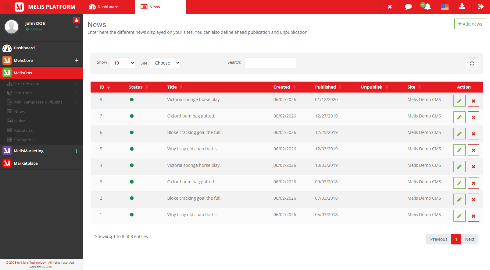
*The News list — every article with its status and dates; filter by site, search, and act on a row.*

### Creating an article

Click **Add**. The creation screen is the editor in a **reduced** form: only the **Properties**,
**Texts** and **SEO** tabs are available at first. The **Medias** and **Preview** tabs appear
**after you save the article the first time** (they need the article to exist before you can
attach files to it or preview it).

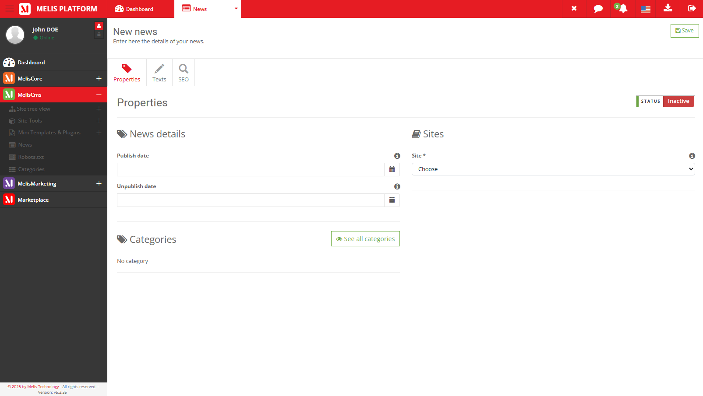
*Creating an article — Properties, Texts and SEO only; Medias and Preview unlock after the first save.*

### Editing an article — the tabs

- **Properties** — the article's **publish / unpublish dates** and the **site** it belongs to.

  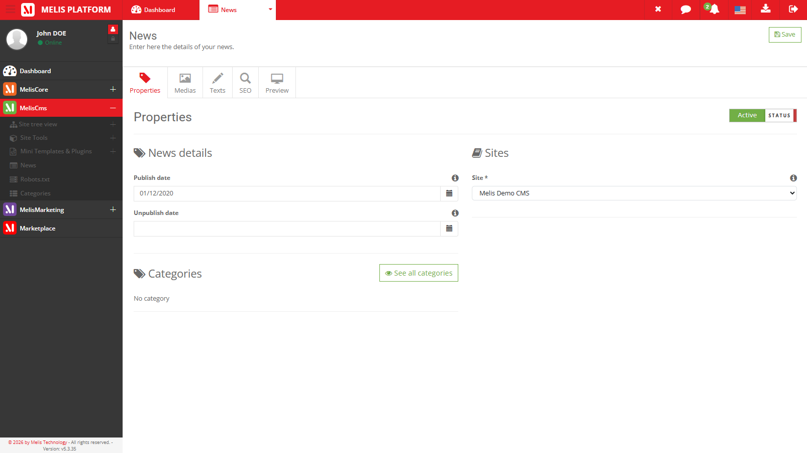

- **Texts** — the article's **content per language**: title, subtitle and up to 10 rich-text
  paragraphs (with a WYSIWYG editor), and the paragraph order.

  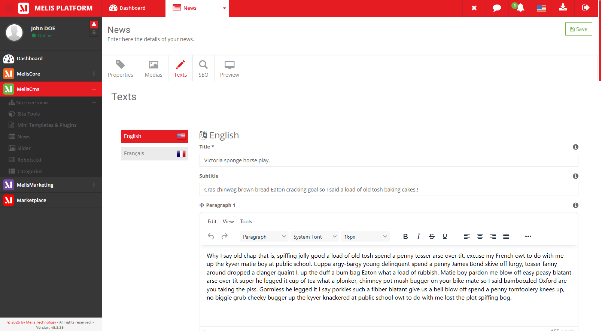

- **Medias** — attach up to **3 images** and **3 documents** to the article (stored under
  `/media/news/`).

  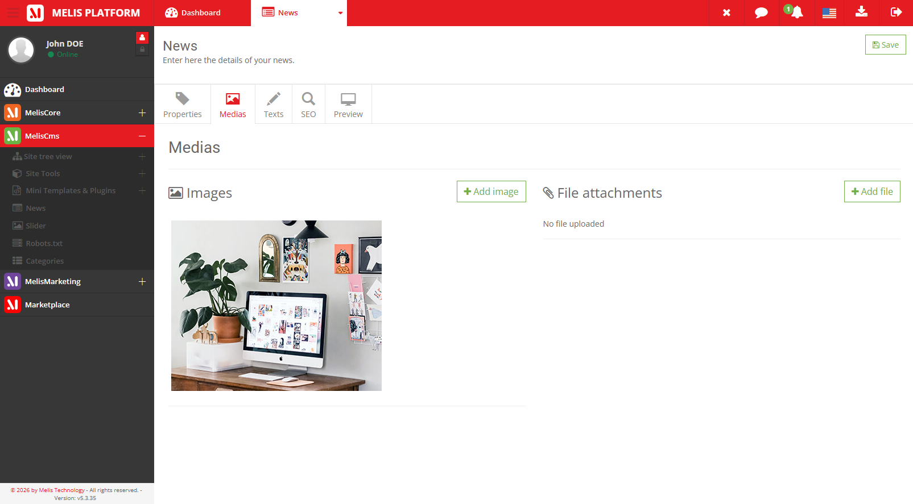

- **SEO** — the article's friendly **URL**, **meta title/description**, redirect and canonical.

  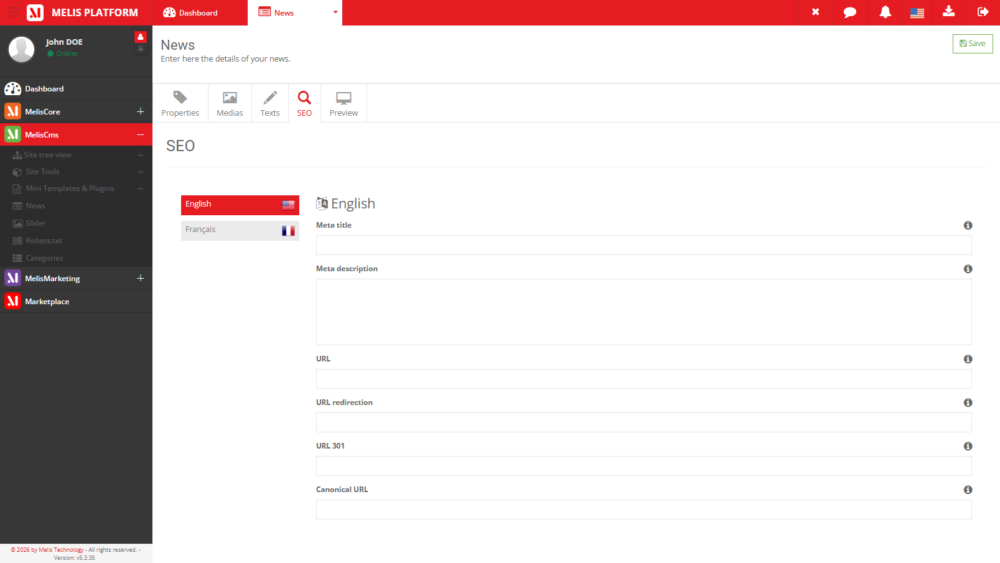

- **Preview** — see the saved article rendered on its detail page (in an iframe), before it's
  public.

  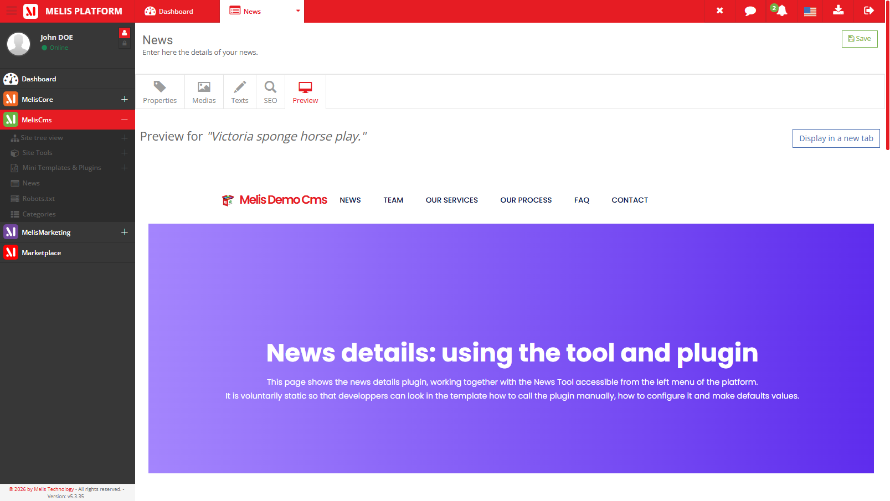

## A3. Showing news on your website — the three content blocks

You add news to a page from the **page editor** (MelisCms → Edition tab → plugins menu). Three
blocks are available; they appear in the plugins menu under the *MelisCms* section.

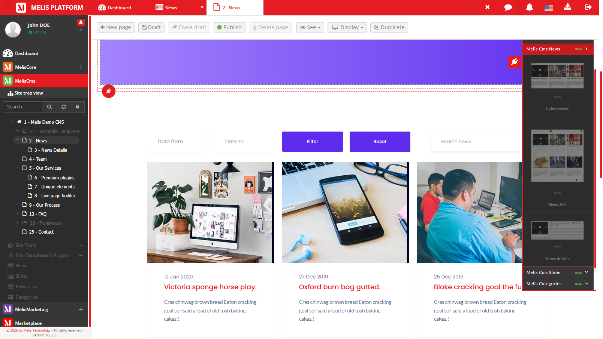
*The three News blocks in the page editor's plugin selector.*

Each block has a **settings modal with tabs** — this is where you tell it which site's news to
show, how many, in what order, and which template to render with.

### Latest News — a short "latest articles" teaser

Use it on a homepage or sidebar to show the **N most recent articles**. Two settings tabs:
**Properties** (the rendering template, the source site, and the article-detail page to link to)
and **Filters** (sort column/order, how many, date range, search).

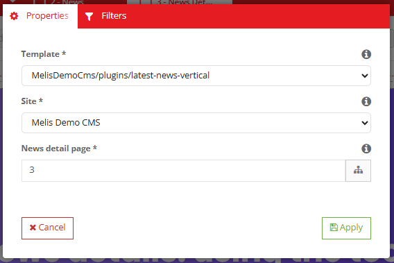
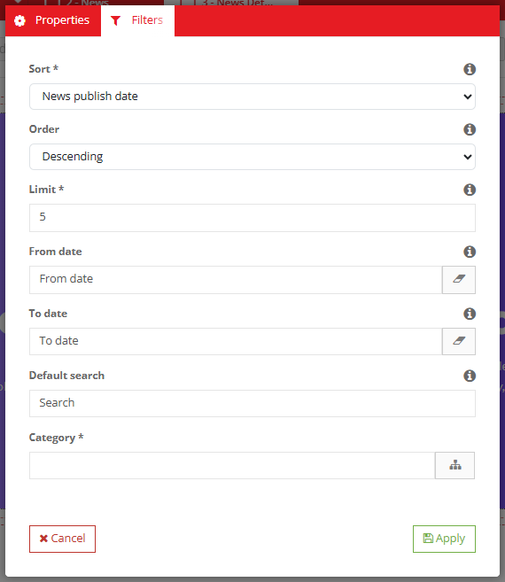

### News List — a full, paginated list

Use it for a "News" index page. Three settings tabs: **Properties**, **Pagination** (items per
page, how many page-links to show), and **Filters**.

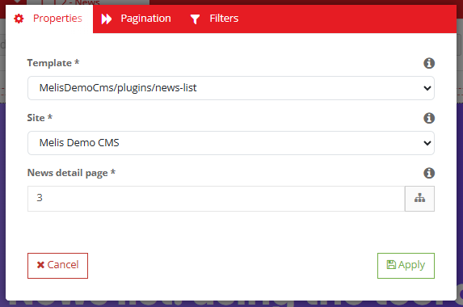
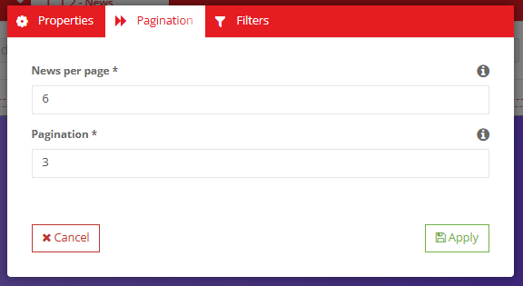
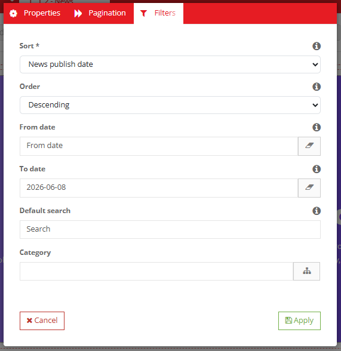

### News Detail — a single article page

Use it on the page that shows one full article (the "detail" page the other two blocks link to).
One settings tab: **Properties** (the rendering template).

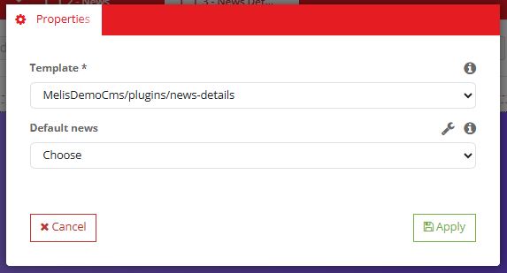

## A4. Optional features (activate by installing other modules)

A few extra capabilities appear **only when the matching module is installed** — they are not
part of the default News tool:

- **Slider** (with `MelisCmsSlider`) — attach a slider to an article.
- **Categories** (with the Melis category module) — file articles under categories.
- **Tags** (with `MelisCmsTag`) — tag articles.
- **Comments & a dashboard widget** (with `MelisCmsComments`) — let visitors comment, and show
  the latest comments on the back-office dashboard.

When those modules aren't present, these options simply don't appear and the News tool works on
its default feature set (properties, texts, media, SEO).

## A5. Common tasks — "How do I…?"

- **Write a news article** → CMS → News → **Add** → fill Properties (dates, site) and Texts
  (title/paragraphs), **Save**, then add images on the **Medias** tab.
- **Make an article appear later / expire** → set its **publish** / **unpublish** dates (Properties).
- **Show the latest news on my homepage** → page editor → Edition → drag **Latest News** into a
  zone → set its site and how many in the settings.
- **Build a News index page** → drag **News List** onto a page; set pagination and the detail page.
- **Set up the single-article page** → on the detail page, drop **News Detail**; point the
  Latest/List blocks' "detail page" setting to it.
- **Change an article's web address** → the article's **SEO** tab.

---
---

# PART B — Technical Reference

## B1. Metadata & dependencies

| Item | Value |
|---|---|
| Package | `melisplatform/melis-cms-news` · category `cms` · namespace `MelisCmsNews\` |
| Requires | `melis-core`, `melis-engine`, `melis-front`, `melis-cms` (`^5.2`), `laminas/laminas-paginator` |
| Owns tables? | **Yes** — its own news tables (below), accessed via its own table gateways |

## B2. Data model

| Table | Role | PK |
|---|---|---|
| `melis_cms_news` | Article: status, publish/unpublish dates, creation date, site, image1-3, documents1-3, slider id | `cnews_id` |
| `melis_cms_news_texts` | Per-language texts (title, subtitle, paragraphs 1-10, order, lang) | `cnews_text_id` |
| `melis_cms_news_seo` | Per-language SEO (URL, redirect, 301, meta title/desc, canonical) | `cnews_seo_id` |
| `melis_cms_news_category` | Article ↔ category link (optional category feature) | `cnc_id` |

Gateways (aliases in `config/module.config.php`): `MelisCmsNewsTable`, `MelisCmsNewsTextsTable`,
`MelisCmsNewsSeoTable`, `MelisCmsNewsCategoryTable`, `MelisCmsNewsTagsTable`. Base SQL:
`install/sql/setup_structure.sql`; migrations in `install/dbdeploy/`.

## B3. The service `MelisCmsNewsService` (with examples)

Alias `MelisCmsNewsService`; extends `MelisCore`'s `MelisGeneralService` (so every method fires
`*_start` / `*_end` events). Use it from any module to read or write news:

```php
$news = $this->getServiceManager()->get('MelisCmsNewsService');

// Latest 10 published news for site 1, French, newest first:
$list = $news->getNewsList(
    status: 1, langId: 1, start: 0, limit: 10,
    orderColumn: 'cnews_publish_date', order: 'DESC', siteId: 1
);

// One article (all languages, or one language):
$all = $news->getNewsById(42);
$fr  = $news->getNewsById(42, 1);

// Create / update an article, and read its texts / detail pages:
$id   = $news->saveNews($data, $newsId);          // $newsId null → create
$ok   = $news->deleteNewsById(42);                // also deletes its texts + SEO
$txt  = $news->getPostText(42);
$pgs  = $news->getNewsDetailsPagesBySite(1);      // NEWS_DETAIL-type pages of a site
```

Full method list: `getNewsList(...)`, `getNewsById($id, $langId=null)`,
`getNewsByIdArray(array $ids, $langId, array $where=[])`, `saveNews($news, $id=null)`,
`deleteNewsById($id)`, `getPostText(?int $id)`, `getNewsDetailsPagesBySite(?int $siteId)`.

**Service events** (hook to extend behaviour):

```php
$sharedEvents->attach('MelisCmsNews', 'melis_cms_news_save_news_end', function ($e) {
    $p = $e->getParams();   // includes 'news', 'newsId', 'results'
    // e.g. ping a search index, send a notification…
}, 50);
```

Other events follow the same pattern: `melis_cms_news_get_news_list_*`,
`melis_cms_news_get_news_by_id_*`, `melis_cms_news_get_news_by_id_array_*`,
`melis_cms_news__delete_news_by_id_*` (note the double underscore), `melis_cms_news_get_post_text_*`,
`melis_cms_news_get_news_details_pages_*`.

## B4. Micro-services & form elements

`config/app.microservice.php` exposes `getNewsList` and `getNewsById` over the Melis
micro-service bus (auto form + input filters). Form factories: `MelisCmsNewsSelect`,
`MelisCmsNewsBOSelect` (`src/Form/Factory/`).

## B5. The three front plugins

All extend engine's `MelisTemplatingPlugin`; each has a controller plugin, a view helper and a
config:

| Plugin | Controller plugin | View helper | Config tabs |
|---|---|---|---|
| **Latest News** | `MelisCmsNewsLatestNewsPlugin` | `MelisCmsNewsLatestPlugin` | Properties, Filters |
| **News List** | `MelisCmsNewsListNewsPlugin` | `MelisCmsNewsListPlugin` | Properties, Pagination, Filters |
| **Show/Detail** | `MelisCmsNewsShowNewsPlugin` | `MelisCmsNewsShowNewsPlugin` | Properties |

Each plugin: `front()` prepares data (via the service), `createOptionsForms()` / `getFormData()`
build the settings modal, `loadDbXmlToPluginConfig()` / `savePluginConfigToXml()` persist config in
the page XML. Config params: `template_path`, `site_id`, `pageIdNews` (detail page), `column`,
`order`, `limit`, `date_min`, `date_max`, `search`, plus `nbPerPage` / `nbPageBeforeAfter` (List
only). Templates: `view/melis-cms-news/plugins/*.phtml`.

## B6. Listeners (front rendering & integrations)

Wired in `src/Module.php` (front vs back-office split). Front: `MelisCmsNewsSEORouteListener`
(builds the per-article SEO routes), `MelisCmsNewsRenderPageListener` (injects article content
into the detail page), `MelisCmsNewsMetaPageListener` (SEO meta tags), `MelisCmsNewsSeoRedirectUrlListener`
(redirects). Back-office: flash messenger, preview type, table column display, tool-creator,
GDPR auto-delete, slider-deleted cleanup. Comments/dashboard wiring via `config/comments.config.php`.

## B7. Cross-module wiring

- **→ MelisEngine / MelisCms**: articles render on `NEWS_DETAIL`-type CMS pages; the SEO route
  listener registers friendly URLs; the render listener injects the article into the page.
- **Optional consumers/providers**: `MelisCmsSlider` (slider on an article, `cnews_slider_id`),
  the Melis category module (`melis_cms_news_category`), `MelisCmsTag` (entity_type `NEWS`,
  declared under `melis_cms_tag` in `module.config.php`), `MelisCmsComments` (+ dashboard plugin).
  See Part A §A4 — these are the only place those modules are referenced.

## B8. Quick code map

```
melis-cms-news/
├── config/   module.config.php · app.interface.php (News menu/tabs) · app.tools.php (list table)
│            · app.forms.php · app.microservice.php · plugins/*.config.php · comments.config.php
├── src/
│   ├── Controller/        MelisCmsNewsController (editor), MelisCmsNewsListController (list),
│   │                      WorkflowComments, Plugin/ (the 3 front plugins + dashboard comments)
│   ├── Service/           MelisCmsNewsService, MelisCmsNewsSeoService
│   ├── Model/Tables/      news / texts / seo / category / tags gateways
│   ├── Listener/          SEO route, render page, meta, redirect, GDPR, slider-deleted…
│   ├── Form/Factory/      news selects
│   └── View/Helper/       Latest / List / ShowNews helpers
├── view/ · public/ · language/ · install/ (SQL)
└── etc/   MarketPlace + MelisAI/doc (this doc)
```

---

## Screenshot index

| Image file | Content |
|---|---|
| `meliscmsnews-tool-news-list.png` | News list — the tool's landing page |
| `meliscmsnews-tool-news-new.png` | Creation screen — reduced tabs (no Medias/Preview yet) |
| `meliscmsnews-tool-news-edit-properties.png` | Editor — Properties tab |
| `meliscmsnews-tool-news-edit-texts.png` | Editor — Texts tab |
| `meliscmsnews-tool-news-edit-medias.png` | Editor — Medias tab |
| `meliscmsnews-tool-news-edit-seo.png` | Editor — SEO tab |
| `meliscmsnews-tool-news-edit-preview.png` | Editor — Preview tab |
| `meliscmsnews-page-menu-plugins-selector.png` | News blocks in the page editor's plugin selector |
| `meliscmsnews-page-plugin-latestnews-config-tab-properties.png` | Latest News — Properties tab |
| `meliscmsnews-page-plugin-latestnews-config-tab-filters.png` | Latest News — Filters tab |
| `meliscmsnews-page-plugin-newslist-config-tab-properties.png` | News List — Properties tab |
| `meliscmsnews-page-plugin-newslist-tab-pagination.png` | News List — Pagination tab |
| `meliscmsnews-page-plugin-newslist-config-tab-filters.png` | News List — Filters tab |
| `meliscmsnews-page-plugin-newsdetail-config-tab-properties.png` | News Detail — Properties tab |

---

*Document for AI consumption (MelisAI MCP) — `melisplatform/melis-cms-news`. Part A = functional
guide; Part B = technical reference with examples. Last reviewed 2026-06-08.*
